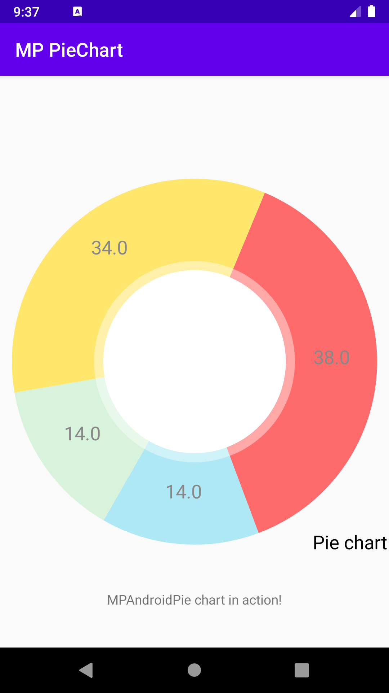

# MPAndroidChart-PieChart

This is a sample of the MP android pie chart using Kotlin language.
 
Check the link for more details:  <a href="https://weeklycoding.com/mpandroidchart/"> MPAndroidChart</a>
 

